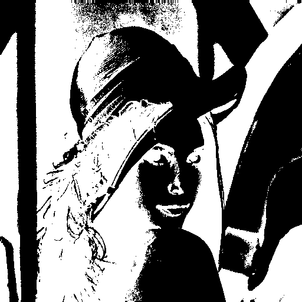

# wgimage

[](https://crates.io/crates/wgimage)

WebGPU Image Processing Library.

## Getting started

```sh
git clone https://github.com/neka-nat/wgimage.git
cargo run --release --example grayscale
```

## Results

### Original


### Grayscale


### Gaussian blur


### Threshold



## Reference

https://github.com/redwarp/filters
